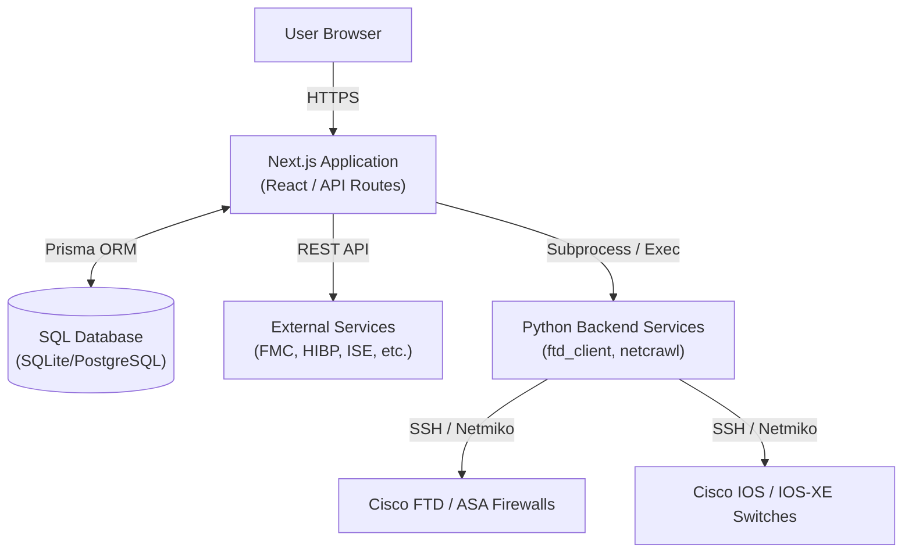

# Pane-O-Glass: Technical Design Document

## 1. Executive Summary

Pane-O-Glass (formerly InfoSec Tools) is a centralized, role-based Information Security utility suite. It provides a "single pane of glass" bridging modern web interfaces with disparate infrastructure, allowing network and security analysts to rapidly investigate, monitor, and mitigate network events.

### 1.1 The Problem It Solves (The "Why")
Enterprise security and network environments often rely on multiple disjointed systems—Firewalls, Identity Engines, Cloud APIs, and raw Network Switches. Traditionally, troubleshooting an issue (like a dropped VPN tunnel) required analysts to open terminal sessions, authenticate to multiple firewalls, and manually correlate command outputs. Pane-O-Glass eliminates this friction by abstracting the complex raw telemetry into actionable web-based dashboards while maintaining strict safety rails.

## 2. High-Level Architecture

### 2.1 Technology Choices (The "How" and "Why")
- **Next.js & React:** Chosen for its seamless blending of frontend components and server-side API routes. It allows the platform to render complex stateful dashboards (like interactive topologies or live terminal output) while keeping sensitive API credentials and Python execution secure on the server.
- **Prisma (ORM):** Chosen for type-safe database queries. It manages the schema for audit logs, permissions, and crawler snapshots, allowing easy transition between SQLite (for local development) and PostgreSQL (for production).
- **Python (Backend CLI Tools):** While Node.js handles the web layer well, interacting with legacy networking gear via SSH, parsing raw Cisco CLI outputs, and managing complex concurrent network crawling is significantly more robust in Python (using libraries like `netmiko` and `concurrent.futures`). Thus, the Node.js API acts as an orchestrator that invokes Python subprocesses.

## 3. Core Features & Implementations

### 3.1 Network Discovery & Mapping (NetCrawl)
A powerful SSH-based network crawler designed to map Cisco IOS infrastructure.

- **How it works:** Administrators define "Seed" IP addresses and a maximum hop count. The Next.js API launches the Python `netcrawl` engine. The engine spawns multiple concurrent worker threads that SSH into the switches. It executes discovery commands (`show cdp neighbors`, `show ip route`), parses the unstructured text into JSON models, and saves the "Snapshot" to disk/database.
- **Why this approach?** Traditional SNMP polling can be slow and often lacks rich Layer 3 routing data. By scraping SSH outputs (via `netmiko`), the application builds a true "point-in-time" topological graph of the network, accurately mapping VLANs, port channels, and Active/Standby routing states.
- **Hop-by-Hop Path Tracer:** Rather than just drawing a map, NetCrawl implements a routing simulator. By capturing Longest Prefix Match (LPM) routing tables and ARP caches during the crawl, the Next.js frontend can simulate how a packet traverses the network between any two IPs, highlighting the exact path in glowing blue on the visual map.

### 3.2 Cisco S2S VPN Diagnostics (FTD Client)
A specialized tool to investigate and resolve Site-to-Site (S2S) VPN connectivity issues.

- **How it works:** The dashboard aggregates policy data from the Cisco FMC (Firepower Management Center) via REST API. When an analyst clicks "Investigate", the backend SSHes directly into the active FTD Firewall appliance and polls the underlying Lina engine for live IKEv2 and IPsec Security Association (SA) counters.
- **Dual Diagnostic Telemetry (The "Why"):** Traditional ping tests from internal servers often fail or mislead when remote peers block internal subnets or drop ICMP entirely. Pane-O-Glass solves this by executing L3 ICMP probes *directly from the firewall's outside interface*, paired with the L7 cryptographic SA state. This provides a definitive verdict (e.g., "ICMP is blocked by peer, but cryptographic tunnels are ACTIVE and passing traffic").
- **HA Cluster Awareness:** Network firewalls often run in High-Availability pairs. The Python tool dynamically detects the `Active` vs `Standby` node and guarantees that diagnostic commands are executed on the node actually processing traffic.
- **Safe Mode Bouncing:** Users can execute a soft bounce (Phase 2 IPsec) or hard re-key (Phase 1 IKEv2). By default, the application runs a "dry-run" simulation, previewing the exact Cisco commands without mutating the firewall, ensuring safety before live execution.

### 3.3 Identity & Threat Integrations (HIBP & ISE)
- **Cisco ISE (Identity Services Engine):** The application queries ISE to map live user sessions to MAC/IP addresses on the network, providing context during security investigations.
- **Have I Been Pwned (HIBP):** Integrates with the HIBP API to allow analysts to audit corporate domains for breached credentials, ensuring quick response to external data leaks.

## 4. Security, Auditing, & Access Control

### 4.1 Role-Based Access Control (RBAC)
- **How it's implemented:** Permissions are centrally managed in a Prisma database table and evaluated by Next.js middleware and API routes. Access is split across granular roles: Admin, Analyst, Network, and User. 
- **Why:** Not all users should be able to bounce a VPN or map the entire network. RBAC ensures that Tier 1 helpdesk users can view health status, while only Tier 3 Network Engineers can mutate firewall states.

### 4.2 Comprehensive Audit Logging
- **How it's implemented:** Every time a user initiates a diagnostic query or mutation, an entry is written to the Prisma database logging the user ID, target, action type (e.g., `VPN_S2S_BOUNCE`), mode (`DRY-RUN` vs `LIVE`), and the exact commands executed.
- **Why:** In regulated environments, "who changed what and when" is critical. The built-in audit trail provides non-repudiation and compliance reporting (including CSV exports) without relying on external syslog servers parsing scattered application logs.

### 4.3 Ephemeral Credentials
- **How it's implemented:** For highly sensitive tasks (like network crawling or firewall mutations), users can enter custom credentials directly into the UI modal. These credentials are encrypted in-memory and passed securely to the backend Python sub-processes via standard input (stdin) or temporary environment variables. 
- **Why:** This ensures that highly privileged "God Mode" passwords are never permanently written to the application's configuration files, database, or disk, heavily mitigating the risk of credential theft if the application server is compromised.

## 5. Offline Resiliency (Standalone CLI Mode)
- **How it's implemented:** The Python services (`ftd_client.py` and `main.py`) use `argparse` to provide fully featured command-line interfaces.
- **Why:** During a severe network outage, the web server or its database might become inaccessible. Network engineers can directly execute the Python tools from a jumpbox or terminal to map the network or bounce VPNs, ensuring the diagnostic tools remain available during "break-glass" scenarios.
