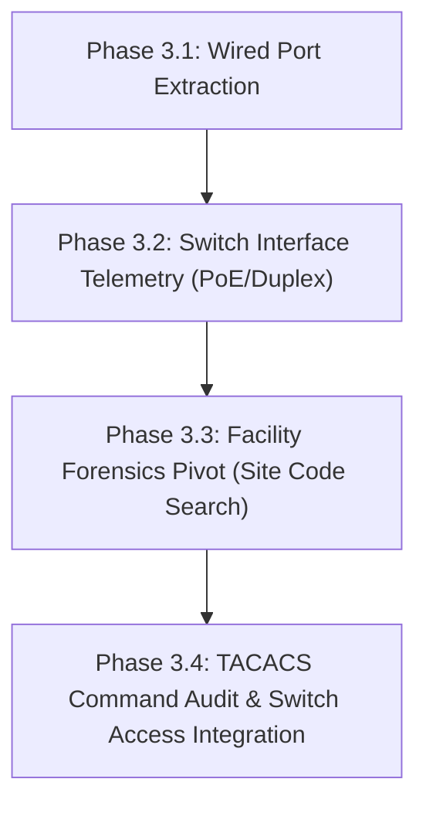

# Cisco ISE Operations Center — Strategic Roadmap & Triage Plan

This document establishes the comprehensive roadmap for the **Cisco ISE Operations Center**, cataloging everything implemented to date, currently in progress, and prioritized for upcoming iterations—with special focus on **deep wired network switch visibility** and the **site forensics pivot**.

---

## 1. Executive Summary & Capabilities Matrix

| Capability Area | Current Status | Description |
|---|---|---|
| **Passive Identity Engine** | ✅ **Production Ready** | Reverse DNS + AD LDAP computer enrichment. Classifies Windows Enterprise OS builds, OU placement, and DC Event 4624 logons (covering 55.4% of Cooper Health active sessions). |
| **WLC 8540 SNMP Telemetry** | ✅ **Production Ready** | Real-time 802.11 client state, RSSI/SNR signal meters, and client exclusion/blacklist checks via `KEL-2MC-WLC-CAMPUS` and `KEL-2MC-WLC-AMB`. |
| **Unified Single Smart Search Bar** | ✅ **Production Ready** | Removed cosmetic toggles (`Forensic Lookup`, `Lockout Hunter`, `EAP Doctor`). Auto-detects usernames, IPs, MACs, and evaluates project boolean AST syntax (`AND`, `OR`, `NOT`, `()`). |
| **Interactive Path Visualizer** | ✅ **Production Ready** | Hop-by-hop authentication path with in-line RF RSSI link pills between Endpoint and AP. Clickable nodes reveal contextual telemetry in a spotlight drawer. |
| **Adaptive Endpoint Cards** | ✅ **Production Ready** | Hides inapplicable fields so PassiveID sessions don't display "Unknown Switch" or "N/A SSID", and wired sessions don't show blank AP names. |
| **Dynamic Reference Dictionaries** | ✅ **Production Ready** | Dedicated tab housing live ERS Identity Groups (35), OpenAPI SGT tags (18), and MnT Failure Codes catalog (829). |
| **Wired Switch & Port Visibility** | 🟡 **Prioritized (In Roadmap)** | Deep switch visibility: physical port ID (`GigabitEthernet1/0/23`), port speed/duplex, voice/data VLAN, PoE status, and switch CDP/LLDP neighbors. |
| **Facility Forensics (Site Code Pivot)** | 🟡 **Prioritized (In Roadmap)** | Searching site codes (e.g. `3CP`, `CUH`, `L3B`) pivots directly into a dedicated Facility Triage view showing all active endpoints, switches, and failures at that hospital campus. |

---

## 2. Completed Milestones (Phase 1 & Phase 2)

### Phase 1: Identity & Wireless Correlation
- [x] **Passive Identity Resolution (`src/lib/ise.ts`, `src/lib/ldap.ts`)**:
  - Non-blocking reverse DNS (`172.17.85.2` $\to$ `lapxrem92521.chsmail.root.cooperhealth.edu`).
  - Queries AD LDAP for operating system version and workstation OU placement.
  - Added ActiveList fallback for surgical IP lookups.
- [x] **WLC SNMP Telemetry (`src/lib/wlc.ts`)**:
  - Configured for `InfoSecUtil-02a` (Dev) and `InfoSecUtil-02` (Prod).
  - Queries live association status and signal metrics from AireOS 8540 controllers.
- [x] **7-Day History & EAP Doctor Trace (`src/components/ise/AuthHistoryTimeline.tsx`)**:
  - Chronological pass/fail table with 1-click expansion of 802.1X protocol handshake steps.

### Phase 2: Operations Center Overhaul & Interactive Path
- [x] **Single-Page Diagnostic Story**: Eliminated fragmented tab switching between live session and 7-day history.
- [x] **Boolean Search Integration (`src/lib/booleanQueryParser.ts`)**: In-memory AST evaluation for complex queries (`(CUH OR 3CP) AND NOT windows`).
- [x] **Interactive Path Visualizer (`src/components/ise/ConnectionPath.tsx`)**:
  - Direct in-line RSSI pill on the RF connector.
  - Interactive clickable nodes with telemetry spotlight drawer.
- [x] **Reference Dictionaries Tab**: Moved static textbook group and failure dumps out of primary triage into a searchable reference library.

---

## 3. High-Priority Roadmap: Wired Switch & Port Visibility

Currently, wired endpoint lookups show the switch name (`nas_identifier`) and VLAN, but lack the physical layer details network and security engineers need during troubleshooting.

### Objective: Transform Wired Triage into a First-Class Citizen
```
[Client PC / Medical Device]
             │
             ▼
  [Switch: 3CP-1SC-SWI-1]
     ├── Interface: GigabitEthernet1/0/14 (Data VLAN 102, Voice VLAN 202)
     ├── Port State: Connected (1000 Mbps / Full Duplex)
     ├── Power over Ethernet (PoE): Consuming 12.4W (Class 3 / Powered)
     ├── 802.1X Port Status: Authorized (Multi-Domain Auth)
     └── Uplink: Te1/1/1 -> 3CP-CORE-SWI-1
             │
             ▼
      [Cisco ISE 3.5]
```

### Proposed Wired Enhancements:
1. **Physical Port Extraction (`nas_port_id`)**:
   - In Cisco ISE RADIUS accounting, `NAS-Port-Id` contains the exact physical switchport (e.g. `GigabitEthernet1/0/14`).
   - Extract and prominently display the physical interface, speed, and duplex in the wired endpoint card.
2. **Switch SNMP & CDP/LLDP Integration**:
   - Query the switch via SNMP (or ISE switch telemetry) for:
     - Admin status (`up` / `down` / `err-disabled`).
     - PoE consumption (vital for IP phones, badge readers, and medical carts).
     - MAC address table count on that port (detecting unmanaged hubs or rogue devices).
3. **Wired Connection Path Node**:
   - In `ConnectionPath.tsx`, clicking the **Access Switch** node will display:
     - Switch Hostname & Management IP.
     - Physical Port & Module.
     - Port VLANs (Access Data VLAN + Voice Auxiliary VLAN).
     - Switch Model & IOS Version (e.g., `Catalyst 9300-48P`, `17.9.4a`).

---

## 4. High-Priority Roadmap: Facility Forensics (Site Code Search Pivot)

### Objective: Seamless Site Code Searching in Main Search Bar
When an engineer enters `3CP`, `CUH`, `L3B`, or `AMB`:

1. **Intelligent Query Classifier**:
   - Detects if the query matches a recognized site code (from the 198 configured switches or `sites.csv`).
2. **Facility Forensics Dashboard**:
   - **Campus Header**: Facility full name, physical address, and Google Maps link.
   - **Campus Infrastructure**: Live count of active switches, WLCs, and APs at that location.
   - **Active Sessions at Facility**: All wireless and wired endpoints currently active on switches/APs starting with that site code prefix.
   - **Recent Campus Failures**: Top 802.1X/RADIUS failures logged at that facility in the last 24h/7d (e.g., bad certs on a specific floor or switch).

---

## 5. Implementation Sequence & Next Steps



1. **Step 1 (Immediate Next Focus)**: Extract and display `nas_port_id` (Physical Port) and Wired Authorization status on wired sessions in `EnrichedEndpointCard.tsx` and `ConnectionPath.tsx`.
2. **Step 2**: Implement Switch SNMP polling for port state, PoE wattage, and VLAN assignment.
3. **Step 3**: Implement the Site Code Search Pivot in `fetchIseSession` and `page.tsx` for campus-wide forensic drilldown.
