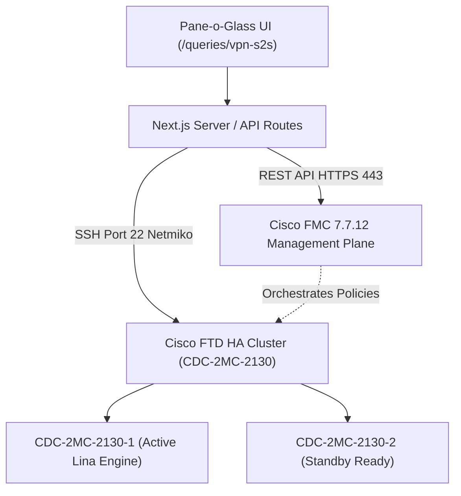

# Cisco FTD / FMC Site-to-Site VPN Monitor & Investigation Suite

## 1. Overview & Architecture

The **Site-to-Site VPN Monitor** (`/queries/vpn-s2s`) is an enterprise operational dashboard designed for network engineers and security analysts. It bridges two distinct Cisco management layers into a single pane of glass:



1. **FMC Management Plane (REST API)**:
   - Synchronizes complete policy topology, tunnel names, endpoint IPs, peer device IDs, protected traffic selectors (local and remote subnets), and cryptographic proposals across all 48+ Site-to-Site tunnels.
2. **FTD Data Plane (Direct SSH Port 22)**:
   - Cisco FMC does **not** expose REST endpoints to interrogate real-time SA counters or execute operational clears.
   - The backend uses a specialized Netmiko runner to connect directly into the active FTD unit (`CDC-2MC-2130-1`), elevating into the underlying Cisco Lina engine (`system support diagnostic-cli`) to read live hardware counters and execute operational re-keys.

---

## 2. Configuration & Credentials

### Environment Variables (`.env`)

```env
# Cisco FMC REST API Credentials
FMC_URL=https://fmc01.chsmail.root.cooperhealth.edu
FMC_USER=infosectools-api
FMC_PASSWORD=<PASSWORD>
FMC_DOMAIN_UUID=e276abec-e0f2-11e3-8169-6d9ed49b625f

# Direct SSH Access for S2S VPN Terminating HA Cluster
S2S_FIREWALL_CONFIG='[
  {
    "id": "cdc-2mc-2130-1",
    "name": "CDC-2MC-2130-1",
    "ip": "172.16.2.53",
    "user": "admin",
    "pass": "<SSH_PASSWORD>"
  },
  {
    "id": "cdc-2mc-2130-2",
    "name": "CDC-2MC-2130-2",
    "ip": "172.16.2.63",
    "user": "admin",
    "pass": "<SSH_PASSWORD>"
  }
]'
```

### In-App Setup Modal (Ephemeral Session Configuration)
If you prefer not to store credentials in `.env`, click **"Configure FMC / FTDs"** at the top right of the dashboard. This stores credentials in memory for the active server process without writing them to disk.

---

## 3. Dashboard Features & Layout

* **Pinned Upper Area**: The header, HA cluster metrics ribbon, search bar, gateway/status dropdowns, and top pagination toolbar stay locked in place.
* **Scrollable Tunnel Stream**: Only the middle list of tunnel cards scrolls, preventing disorienting full-page jumps.
* **Dual Pagination**: Quick page switching controls are placed at both the top and bottom of the scrollable list (10, 25, 50, or 100 items per page).
* **Zero-Latency In-Memory Caching**:
  * **Client-Side**: Hydrates immediately from `localStorage` (`pane_s2s_vpn_cache`) on page load.
  * **Server-Side**: 60-second in-memory cache with single-flight locking (`stale-while-revalidate`), preventing redundant FMC API calls when switching between tools.

---

## 4. Live Tunnel Investigation

Clicking **"Investigate"** on any tunnel card initiates an automated diagnostic routine:

1. **Active Node Resolution**: Discovers which node in the `CDC-2MC-2130` HA cluster is currently `Active` vs `Standby Ready` (via `show failover state`).
2. **Command Interrogation**: Issues the following commands against the active engine:
   - `show crypto ikev2 sa | include <peer_ip>` *(Phase 1 IKEv2 state)*
   - `show crypto ipsec sa peer <peer_ip>` *(Phase 2 IPsec SAs, SPIs, packets encaps/decaps, drops)*
   - `show route <peer_ip>` *(Verifies routing table entry for peer IP)*
3. **Structured Synthesis**:
   - Parses ground-truth hardware counters (live encapsulated/decapsulated packets, send/recv errors).
   - Verifies whether local and remote traffic selectors match.
   - Diagnoses root causes (e.g. `TS_UNACCEPTABLE`, `DPD_TIMEOUT`, `NO_PROPOSAL_CHOSEN`).

### Raw Console Viewer
The Investigation modal includes an embedded terminal viewer:
* **Sub-Tabs**: Isolate outputs between `All Telemetry`, `IPsec SAs`, `IKEv2 SA`, and `Routing Path`.
* **Keyword Filter**: Type any keyword (e.g. `spi`, `encaps`, `drop`) into the filter bar to immediately isolate matching lines.
* **Word Wrap Toggle**: Switch between tabular fixed-width view (`whitespace-pre`) and wrapped view (`whitespace-pre-wrap`).
* **Expand Toggle**: Expand the console height from `340px` to `540px` for deep SA reviews.
* **Scroll Containment**: CSS `overscroll-contain` ensures scrolling inside the console terminal never scrolls the outer modal.

---

## 5. Operational Actions: Soft Bounce vs. Hard Re-Key

| Action | CLI Command Issued | What it Clears | Technical Impact | Practical Use Case |
| :--- | :--- | :--- | :--- | :--- |
| **Soft Bounce** | `clear crypto ipsec sa peer <peer_ip>` | Phase 2 (IPsec SAs) | Tears down child IPsec SAs and crypto map transforms; Phase 1 (IKE) remains up. Fast sub-second re-negotiation. | Tunnel shows Phase 1 UP but traffic is black-holed, drop counters are incrementing, or NAT exemption was just corrected. |
| **Hard Re-Key** | `clear crypto ikev2 sa peer <peer_ip>` | Phase 1 + Phase 2 (All SAs) | Tears down both IKEv2 security association and all associated child IPsec SAs. Forces full cryptographic re-handshake. | Tunnel is completely hung, peer credentials (PSK) were updated, or transform proposal was modified. |
| **Ping Peer** | ICMP Echo Request | None | Tests network reachability to remote peer IP without touching cryptographic state. | Verify upstream routing or ISP reachability before initiating a bounce. |

### Safe Mode Protection (Default ON)
* **Safe Mode: ON**: All operational buttons simulate execution (dry-run). The exact command syntax is previewed, and an audit trail entry is recorded without making any changes to the physical firewall.
* **Safe Mode: OFF (LIVE)**: Executes commands live against the active FTD engine over SSH. Access is gated by the RBAC permission matrix.

---

## 6. Role-Based Access Control (RBAC)

The Site-to-Site VPN monitor is gated by the `vpn-s2s` permission key in the centralized Tool Permissions matrix (`/users/permissions`):

| Role | View & Search Tunnels | Run Live Investigation | Export TAC Markdown Report | Safe Mode Simulation | LIVE Soft Bounce / Hard Re-Key |
| :--- | :---: | :---: | :---: | :---: | :---: |
| **ADMIN** | ✅ | ✅ | ✅ | ✅ | ✅ |
| **ANALYST** | ✅ | ✅ | ✅ | ✅ | ✅ |
| **NETWORK** | ✅ | ✅ | ✅ | ✅ | ✅ |
| **USER** | ❌ *(Denied)* | ❌ *(Denied)* | ❌ *(Denied)* | ❌ *(Denied)* | ❌ *(Denied)* |
| **DESKTOP** | ❌ *(Denied)* | ❌ *(Denied)* | ❌ *(Denied)* | ❌ *(Denied)* | ❌ *(Denied)* |
| **SYSTEMS** | ❌ *(Denied)* | ❌ *(Denied)* | ❌ *(Denied)* | ❌ *(Denied)* | ❌ *(Denied)* |

---

## 7. Audit Logging & Compliance

Every action performed in the tool is permanently recorded in the system audit log (`/users/audit`):

* `VPN_S2S_INVESTIGATE`: Logs user ID, target tunnel, remote peer IP, and diagnostic health score.
* `VPN_S2S_BOUNCE`: Logs user ID, action (`clear_ipsec` or `clear_ike`), mode (`DRY-RUN` vs `LIVE`), target firewall, and command issued.
* `VPN_S2S_PING`: Logs reachability test results and latency.
